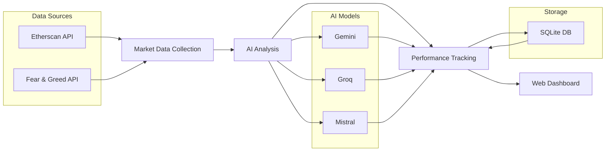

# Simple Crypto Trading Bot Chef

<div align="center">
  
  <p><em>Comparing AI Models in Crypto Trading Analysis</em></p>
</div>

## Overview

A proof-of-concept project that evaluates and compares the trading accuracy of different Large Language Models (LLMs) in cryptocurrency trading. The system provides real-time Ethereum (ETH) market data to multiple AI models and analyzes their performance through an interactive dashboard.

### AI Models in Action

- **Gemini 1.5 Flash** - Google's latest LLM optimized for fast, accurate trading analysis
- **Groq LLaMA-3.1-70B-Versatile** - High-performance model for comprehensive market insights
- **Mistral Large** - Advanced model providing additional trading perspectives

## Key Features

- **Real-time Monitoring**
  - Live ETH price tracking via Etherscan
  - Dynamic gas fee analysis
  - Market sentiment tracking with Fear & Greed Index

- **AI Analysis**
  - Comparative trading signals from multiple LLMs
  - Real-time performance metrics
  - Accuracy tracking and model comparison

- **Interactive Dashboard**
  - Live price and volume charts
  - Model performance visualization
  - Gas price optimization tools

## Quick Start

1. **Setup**
   ```bash
   # Clone the repository
   git clone https://github.com/yourusername/crypto-ai-trader.git
   cd crypto-ai-trader

   # Install dependencies
   poetry install
   ```

2. **Configuration**
   - Copy `.env.example` to `.env`
   - Add your API keys:
     ```env
     ETHERSCAN_API_KEY=your_key_here
     GEMINI_API_KEY=your_key_here
     GROQ_API_KEY=your_key_here
     MISTRAL_API_KEY=your_key_here
     ```

3. **Launch**
   ```bash
   poetry run python src/web/app.py
   ```

## Technical Stack

- **Backend**
  - Python 3.10+
  - Flask web server
  - Poetry for dependency management

- **Frontend**
  - TailwindCSS for modern styling
  - Chart.js for dynamic visualizations

- **APIs**
  - Etherscan for market data
  - Multiple LLM providers for analysis

## System Architecture



## Important Disclaimer

This is an **experimental project** for educational and research purposes only:

- NOT financial advice
- NOT intended for real trading
- NO guarantee of accuracy
- Use at your own risk
- For AI model comparison only

## Requirements

- **System**
  - Python 3.10 or higher
  - Poetry package manager

- **API Keys**
  - Etherscan
  - Google Gemini
  - Groq
  - Mistral

## License

This project is licensed under the [MIT License](LICENSE).

---
<div align="center">
  <em>Built with ❤️ for AI and Crypto enthusiasts</em>
</div>