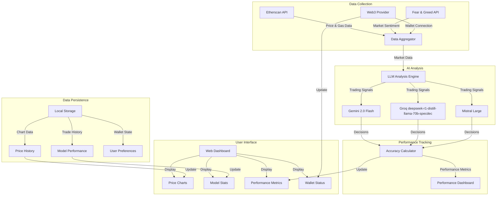
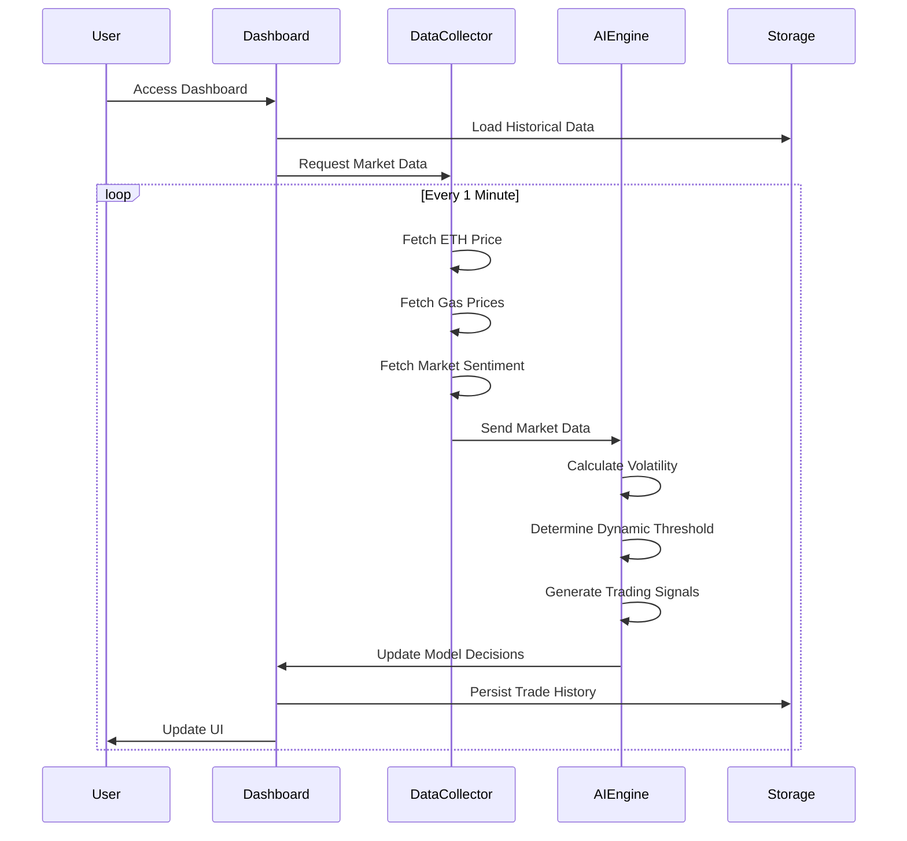
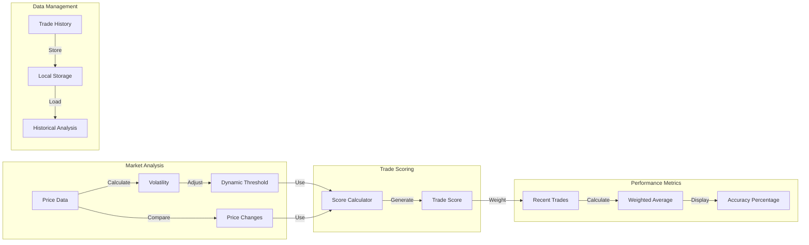

# Simple Crypto Trading Bot Chef

<div align="center">
  
  <p><em>Comparing AI Models in Crypto Trading Analysis</em></p>
</div>

## Overview

A proof-of-concept project that evaluates and compares the trading accuracy of different Large Language Models (LLMs) in cryptocurrency trading. The system provides real-time Ethereum (ETH) market data to multiple AI models and analyzes their performance through an interactive dashboard.

## Live Demo

Check out the live demo at [https://stbchef.onrender.com/](https://stbchef.onrender.com/)

<div align="center">
  
  <p><em>Trading Bot Chef Dashboard - Real-time AI Trading Analysis</em></p>
</div>

### AI Models in Action

- **Gemini 2.0 Flash** - Google's latest LLM optimized for fast, accurate trading analysis
- **Groq deepseek-r1-distill-llama-70b-specdec** - High-performance model for comprehensive market insights
- **Mistral Large** - Advanced model providing additional trading perspectives

## Key Features

- **Real-time Monitoring**
  - Live ETH price tracking via Etherscan
  - Dynamic gas fee analysis
  - Market sentiment tracking with Fear & Greed Index
  - 1-minute update intervals for all metrics

- **AI Analysis**
  - Comparative trading signals from multiple LLMs
  - Real-time performance metrics
  - Advanced accuracy tracking system:
    - Dynamic thresholds based on market volatility
    - Weighted scoring system for recent trades
    - Tracks last 100 trades per model
    - Enhanced performance metrics with market context
    - Shows decision distribution (Buy/Sell/Hold)

- **Interactive Dashboard**
  - ETH Live price and volume charts
  - Model performance visualization
  - Gas price in real time
  - Performance metrics:
    - Total trades
    - Correct trades
    - Incorrect trades
    - Average profit
    - Decision distribution
    - Market volatility indicators

- **MetaMask Integration**
  - Connect wallet for personalized notifications
  - Receive alerts on LLM consensus signals
  - Track performance with wallet connection
  - Persistent wallet connection across sessions

## Technical Implementation

#### LLM Trading Strategy
- **Target Allocations**:
  * ETH: 60-80% in bullish conditions
  * USDC: 40-20% in bullish conditions
  * Dynamic adjustment based on market conditions

- **Rebalancing Triggers**:
  * Price movement beyond 5% threshold
  * Significant market sentiment changes
  * Volatility spikes
  * Gas price optimization opportunities

- **Risk Management**:
  * Maximum position size: 80% in single asset
  * Minimum USDC reserve: 20% for opportunities
  * Gas cost threshold: Only rebalance if potential profit > 2x gas cost
  * Slippage tolerance: Max 0.5% for large trades

- **Technical Indicators**:
  * Volatility analysis
  * Momentum tracking
  * RSI (Relative Strength Index)
  * Support/resistance levels
  * Market sentiment integration

- **Execution Strategy**:
  * Split large trades into smaller chunks
  * Limit order utilization
  * Gas price optimization
  * Market impact consideration

#### Performance Tracking
- **Accuracy Metrics**:
  * Profit/loss after fees
  * Risk-adjusted returns
  * Portfolio rebalancing efficiency
  * Market impact minimization

- **Decision Criteria**:
  * BUY conditions:
    - Price below support level
    - RSI oversold
    - Strong bullish momentum
    - Low gas prices
    - ETH allocation below target
  * SELL conditions:
    - Price above resistance
    - RSI overbought
    - Bearish momentum
    - High gas prices
    - ETH allocation above target
  * HOLD conditions:
    - Price within normal range
    - Current allocation optimal
    - Gas prices unfavorable
    - No clear directional bias

## Performance Tracking

The system implements a sophisticated accuracy tracking system:

1. **Trade Recording**
   - Records all trading decisions (BUY/SELL/HOLD)
   - Tracks price changes after each decision
   - Maintains history of last 100 data points per model for enhanced analysis
   - Stores historical market data in SQLite database for persistence

2. **Dynamic Threshold System**
   - Base threshold of 1% adjusted by market volatility
   - Volatility calculation over 24-hour window
   - Adaptive thresholds based on market conditions
   - Enhanced scoring for larger price movements

3. **Performance Metrics**
   - Weighted average scoring for recent trades
   - Market volatility indicators
   - Dynamic threshold adjustments
   - Enhanced accuracy tracking with market context
   - Historical performance analysis

4. **Visual Indicators**
   - Green: ≥65% accuracy (High Performance)
   - Yellow: ≥45% accuracy (Moderate Performance)
   - Red: <45% accuracy (Low Performance)
   - Real-time updates for price movements and model decisions

5. **Data Management**
   - Intelligent caching system for API responses
   - Market data cache duration: 10 seconds
   - Gas price cache duration: 30 seconds
   - Automatic data cleanup and optimization
   - Local storage for persistent data

6. **Technical Analysis**
   - Real-time calculation of technical indicators
   - Price trend analysis
   - Volume analysis
   - Gas price impact assessment
   - Market sentiment correlation

7. **Notification System**
   - Real-time alerts on model consensus
   - Customizable notifications for connected wallets
   - Price movement alerts
   - Gas price threshold notifications

8. **Error Handling**
   - Graceful degradation on API failures
   - Fallback to cached data when needed
   - Comprehensive error logging
   - Automatic recovery mechanisms

## Quick Start

1. **Setup**
   ```bash
   # Clone the repository
   git clone https://github.com/yourusername/stbchef.git
   cd stbchef

   # Install dependencies
   poetry install
   ```

2. **Configuration**
   - Copy `.env.example` to `.env`
   - Add your API keys:
     ```env
     ETHERSCAN_API_KEY=your_key_here
     GEMINI_API_KEY=your_key_here
     GROQ_API_KEY=your_key_here
     MISTRAL_API_KEY=your_key_here
     ```

3. **Launch**
   ```bash
   poetry run python src/web/app.py
   ```

## Technical Stack

- **Backend**
  - Python 3.10+
  - Flask web server
  - Poetry for dependency management
  - SQLite database for data persistence
  - Comprehensive API error handling and rate limiting

- **Frontend**
  - TailwindCSS for modern styling
  - Chart.js for dynamic visualizations
  - Web3.js for MetaMask integration
  - Real-time data updates
  - Basic responsive design (desktop-first)
  - Interactive charts with zoom capabilities
  - Mobile support limited to basic layout adjustments

- **APIs**
  - Etherscan for market data and gas prices
  - Alternative.me for Fear & Greed Index
  - AI Model Integration:
    - Google Gemini 2.0 Flash
    - Groq deepseek-r1-distill-llama-70b-specdec
    - Mistral Large
  - Automatic API key rotation and error handling

- **Data Processing**
  - Real-time market data analysis
  - Technical indicator calculations
  - Model consensus detection
  - Performance metrics computation
  - Historical data analysis

## System Architecture



## Data Flow



## Performance Tracking System



## Important Disclaimer

This is an **experimental project** for educational and research purposes only:

- NOT financial advice
- NOT intended for real trading
- NO guarantee of accuracy
- Use at your own risk
- For AI model comparison only
- Does NOT execute actual trades
- Historical performance does not guarantee future results
- API rate limits and costs should be considered
- Models may have varying response times and availability

## Requirements

- **System**
  - Python 3.10 or higher
  - Poetry package manager
  - SQLite database
  - Minimum 512MB RAM (optimized)
  - Stable internet connection

- **API Keys**
  - Etherscan (for market data and gas prices)
  - Google Gemini (for Gemini 2.0 Flash)
  - Groq (for deepseek-r1-distill-llama-70b-specdec)
  - Mistral (for Mistral Large)

- **Optional**
  - MetaMask wallet for notifications
  - Modern web browser with JavaScript enabled and localStorage support
  - Screen resolution 1280x720 or higher recommended

## Performance Optimizations

- **Memory Management**
  - Efficient SQLite database with Write-Ahead Logging
  - Automatic cleanup of historical data older than 7 days
  - Memory-efficient data structures using deque
  - LRU caching for expensive calculations
  - Optimized database queries with proper indexing

- **Data Persistence**
  - Local storage for wallet connection state
  - Cached trading history with automatic expiration
  - Automatic recovery of wallet connection
  - Session data persistence across page reloads
  - Graceful handling of storage limits

## License

This project is licensed under the [MIT License](LICENSE).

---
<div align="center">
  <em>Built with ❤️ for AI and Crypto enthusiasts</em>
</div>