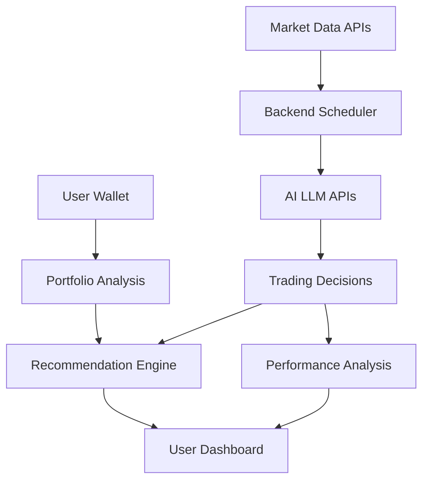

# Simple Crypto Trading Bot Chef

<div align="center">
  
  <p><em>Comparing AI Models in Crypto Trading Analysis</em></p>
</div>

## Overview

A proof-of-concept project that evaluates the trading accuracy of different Large Language Models (LLMs) in cryptocurrency trading. The system provides real-time Ethereum (ETH) market data to multiple AI models and analyzes their performance through an interactive dashboard.

## Live Demo

Check out the live demo at [https://stbchef.onrender.com/](https://stbchef.onrender.com/)

<div align="center">
  
</div>

## Key Features

- **Enhanced UI/UX**
  - Cyberpunk-inspired design with animated elements
  - Advanced network badges with visual network status
  - Wallet address copy function with notification feedback
  - Consistent UI state management during transitions
  - Context-aware error handling with appropriate visual feedback

- **Advanced AI Trading Analysis**
  - Real-time trading signals from multiple LLMs:
    - **Gemini 2.0 Flash** - Google's latest LLM
    - **Groq DeepSeek-R1-Distill-Llama-70B** - High-performance reasoning model
    - **Mistral Medium** - Advanced model for additional perspective
  - Dual accuracy tracking system:
    - Raw accuracy (simple correct/incorrect ratio)
    - Weighted performance score based on decision magnitude
  - Decision distribution analysis (Buy/Sell/Hold)

- **Real-time Market Data**
  - Live ETH price and volume tracking
  - Dynamic gas fee analysis
  - Market sentiment with Fear & Greed Index
  - Price chart with volume indicators

- **Intelligent Portfolio Management**
  - Dynamic portfolio allocation recommendations
  - Balance between AI consensus and portfolio health
  - Automatic detection of severe portfolio imbalance
  - Visual allocation indicators with target range markers
  - Context-aware swap recommendations

- **Robust Wallet Integration**
  - Seamless MetaMask connection with persistent session
  - Support for Ethereum and Linea networks
  - Network-specific token balances with easy switching
  - Personalized alerts on important trading signals
  - Wallet-specific performance statistics

## Technical Architecture



### Unique Features

- **Dynamic Threshold System**: Automatically adjusts trading thresholds based on market volatility
- **Severe Imbalance Detection**: Prioritizes portfolio health over AI consensus when allocation is significantly out of range
- **Weighted Performance Scoring**: More accurately reflects model performance with magnitude bonuses
- **Visual Network Indicators**: Animated network badges that provide real-time connection status
- **State-Consistent UI**: Maintains the same visual design language across all application states

## Technical Stack

- **Backend**: Python 3.10+, Flask, SQLite
- **Frontend**: TailwindCSS, Chart.js, Web3.js
- **APIs**: Etherscan, Alternative.me (Fear & Greed), Google Gemini, Groq, Mistral
- **Web3**: MetaMask integration with Ethereum and Linea support

## Quick Start

1. **Setup Environment**
   ```bash
   git clone https://github.com/yourusername/stbchef.git
   cd stbchef
   poetry install
   ```

2. **Configure API Keys**
   - Copy `.env.example` to `.env`
   - Add your API keys for Etherscan, Gemini, Groq, and Mistral

3. **Launch Application**
   ```bash
   poetry run python -m src.web.app
   # Access at http://localhost:8080
   ```

## Important Disclaimer

This is an **experimental project** for educational and research purposes only:
- NOT financial advice
- NOT intended for real trading
- For AI model comparison only
- Does NOT execute actual trades

## License

This project is licensed under the [MIT License](LICENSE).

---
<div align="center">
  <em>Built with ❤️ for AI and Crypto enthusiasts</em>
</div>