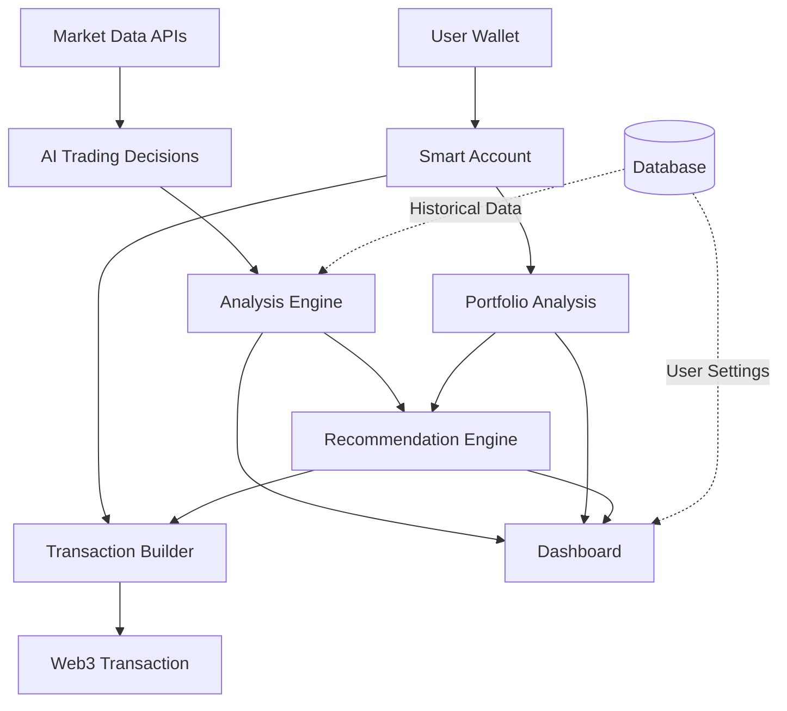

# Simple Crypto Trading Bot Chef

[](https://github.com/qbandev/stbchef/actions/workflows/ci.yml)
[](https://render.com/deploy?repo=https://github.com/qbandev/stbchef)

> **Now Live Trading-Ready 🥳** — The MVP deployed on Render can execute **real ETH ↔︎ USDC swaps** on Linea and Ethereum networks via the built-in `SimpleSwap` DEX contract.

<div align="center">
  
  <p><em>AI-Powered Crypto Trading Bot with Ethereum Pectra Support</em></p>
</div>

## Overview

An AI-powered crypto trading application that evaluates different Large Language Models (LLMs) for accuracy in cryptocurrency trading signals. The application provides real-time Ethereum (ETH) market data to multiple AI models, analyzes their performance, and allows users to execute trades based on AI recommendations through an interactive dashboard.

## Live Demo

Check out the live demo at [https://stbchef.onrender.com/](https://stbchef.onrender.com/)

<div align="center">
  
</div>

## Key Features

- **AI Trading Analysis**
  - Real-time trading signals from multiple LLMs:
    - **Gemini 2.0 Flash** - Google's latest LLM
    - **Groq DeepSeek-R1-Distill-Llama-70B** - High-performance reasoning model
    - **Mistral Medium** - Advanced model for additional perspective
  - Dual accuracy tracking system:
    - Raw accuracy (simple correct/incorrect ratio)
    - Weighted performance score based on decision magnitude
  - Decision distribution analysis (Buy/Sell/Hold)

- **Real-time Market Data**
  - Live ETH price and volume tracking
  - Dynamic gas fee analysis
  - Market sentiment with Fear & Greed Index
  - Price chart with volume indicators

- **Portfolio Management**
  - Dynamic portfolio allocation recommendations
  - Balance between AI consensus and portfolio health
  - Automatic detection of severe portfolio imbalance
  - Visual allocation indicators with target range markers

- **Ethereum Pectra Integration (NEW)**
  - **Smart Account Support** - Implements EIP-7702 for temporary contract functionality
  - **Batch Transactions** - Execute multiple actions in a single transaction
  - **Gas Fee Payment in ERC-20** - Pay transaction fees with USDC instead of ETH
  - **Ethereum & Linea Support** - Seamless operation on both networks

- **Trading Capabilities (NEW)**
  - Execute trades directly from AI recommendations
  - Custom swap interface for manual trading
  - Transaction history tracking
  - Swap confirmation dialogs with price estimates

- **Robust Wallet Integration**
  - Seamless MetaMask connection with persistent session
  - Support for Ethereum and Linea networks
  - Network-specific token balances with easy switching
  - Personalized alerts on important trading signals
  - Wallet-specific performance statistics

## Technical Stack

- **Backend**: Python 3.10+, Flask, SQLite
- **Frontend**: TailwindCSS, Chart.js, Web3.js, Ethers.js
- **Architecture**: Modular JavaScript with dedicated service managers for wallet, notifications, swaps, and analytics
- **APIs**: Etherscan, Alternative.me (Fear & Greed), Google Gemini, Groq, Mistral
- **Web3**: MetaMask integration with Ethereum and Linea support, EIP-7702 implementation

## Quick Start

1. **Prerequisites** (Install these before proceeding)
   - Python 3.10+ (recommended version: 3.10.4)
   - [Poetry](https://python-poetry.org/docs/#installation) for dependency management
   - Node.js 18+ for JavaScript dependencies

2. **Setup Environment** (After prerequisites are installed)
   ```bash
   # Install Python 3.10+ if not installed
   # macOS (using Homebrew):
   brew install python@3.10
   
   # Linux (Ubuntu/Debian):
   sudo apt update
   sudo apt install python3.10 python3.10-venv python3.10-dev
   
   # Install Poetry if not installed
   curl -sSL https://install.python-poetry.org | python3 -
   
   # Clone and set up the project
   git clone https://github.com/qbandev/stbchef.git
   cd stbchef
   
   # Install Python dependencies
   poetry install
   
   # Install JavaScript dependencies
   npm install
   ```

3. **Configure API Keys**
   - Copy `.env.example` to `.env`
   - Add your API keys for:
     - Etherscan
     - Google Gemini
     - Groq
     - Mistral

4. **Launch Application**
   ```bash
   poetry run python -m src.web.app
   # Access at http://localhost:8080
   ```

## Environment Variables (.env)

Copy `.env.example` to `.env` and fill **all** required secrets:

```dotenv
# ---- Core secrets ----
PRIVATE_KEY=                # Wallet key for contract deployment (no quotes)

# ---- RPC endpoints ----
LINEA_RPC_URL=https://rpc.linea.build
LINEA_TESTNET_RPC_URL=https://rpc.goerli.linea.build

# ---- Block-explorer API keys ----
LINEASCAN_API_KEY=
ETHERSCAN_API_KEY=

# ---- Optional AI model keys ----
GEMINI_API_KEY=
GROQ_API_KEY=
MISTRAL_API_KEY=
```

> ⚠️ **Never** commit real secrets. Use Render/CI variable managers in production.

## Ethereum Pectra Integration

This project implements the new Ethereum Pectra upgrade features:

### EIP-7702 Smart Accounts

The application uses the `@metamask/sdk` and `ethers` libraries to create temporary smart accounts for users' Externally Owned Accounts (EOAs), providing smart contract capabilities without permanent deployment.

```javascript
// Create a smart account
const smartAccount = await createSmartAccount(signer);

// Enable EIP-7702 features
await smartAccount.enableFeature(Feature.SessionKeys);
await smartAccount.enableFeature(Feature.BatchTransactions);
await smartAccount.enableFeature(Feature.GasTokenPayment);
```

### Batch Transactions

Group multiple operations (like token approvals and swaps) into a single transaction:

```javascript
const transactions = [
  { to: tokenAddress, data: approvalData },
  { to: swapRouterAddress, data: swapData }
];

// Execute batch transaction
const txHash = await executeBatchTransactions(signer, transactions, useGasToken);
```

### Gas Fee Payment in ERC-20

Pay transaction gas fees using USDC instead of ETH:

```javascript
// Build a Pectra transaction
const pectraTx = buildPectraTx({
  to: recipient,
  data: txData,
  value: 0
}, TokenAddresses.USDC_ETHEREUM); // Use USDC for gas

// Send the transaction
const tx = await signer.sendTransaction(pectraTx);
```

## Technical Architecture



The architecture consists of ten core components:
- **User Wallet**: Connects to MetaMask for EOA access and network selection
- **Smart Account**: Implements EIP-7702 for enhanced wallet capabilities
- **Portfolio Analysis**: Evaluates current holdings and suggests allocation adjustments
- **Market Data APIs**: Provide real-time cryptocurrency data and sentiment indicators
- **AI Trading Decisions**: Multiple LLMs analyze market data and generate buy/sell/hold signals
- **Analysis Engine**: Compares model performance and generates accuracy metrics
- **Recommendation Engine**: Combines AI consensus with portfolio status for actionable insights
- **Transaction Builder**: Creates and executes swap transactions based on recommendations
- **Dashboard**: Interactive user interface presenting all analysis results and swap functionality
- **Database**: Stores historical model performance and user preferences

This modular design ensures separation of concerns while maintaining efficient data flow.

# Deployment & Verification

### One-Click Deploy (Render)

If you have a Render account, press the **Deploy to Render** button above. Render will pick up the `render.yaml` blueprint and provision a free web service. All secrets listed in the blueprint must be supplied in Render's *Environment* tab.

### Manual Local Deploy

1.  Run Hardhat node & deploy contracts locally:

    ```bash
    npm run node                # Start Hardhat local chain
    npm run deploy:local        # Deploy SmartAccount + SimpleSwap + MockUSDC
    ```

2.  Front-end will automatically pick up the local contract addresses (chainId 31337).

### Testnet / Mainnet Deploy

```bash
# Set PRIVATE_KEY and RPC urls in .env
npm run deploy                # Linea Testnet (default)
# or
npx hardhat run scripts/deploy.js --network lineaMainnet
```

### Contract Verification

After deployment you can verify both contracts in one command:

```bash
export SMART_ACCOUNT_ADDRESS=<deployed_smart_account>
export SIMPLE_SWAP_ADDRESS=<deployed_simple_swap>
export USDC_ADDRESS=<usdc_address_used>

npx hardhat run scripts/verify.js --network lineaMainnet
```

If verification succeeds you will see *✔︎* in the console and the contracts will be marked **Verified** on Lineascan / Etherscan.

**Disclaimer**  
This repository is for demonstration purposes. Although it now supports real on-chain swaps, nothing here constitutes financial advice. Use at your own risk and always test with small amounts first.

## Testing

The project ships with three layers of automated tests and a CI workflow that runs them on every push / pull-request.

| Layer | Command | What it covers |
|-------|---------|----------------|
| Solidity / Hardhat | `npx hardhat test` | Unit & integration tests for `SmartAccount`, `SimpleSwap`, mock contracts, happy-path + revert cases. |
| Python | `poetry run pytest` | Database helpers, API utilities, any pure-Python business logic. |
| Playwright (UI) | `npm run test:e2e` | Headless Chromium smoke test that loads the dashboard, verifies core buttons are visible, and ensures the swap button is disabled when contracts are unavailable. |

The CI job defined in `.github/workflows/ci.yml` executes all three layers. The Playwright configuration (`playwright.config.js`) automatically spins up the Flask server on port 8080 before running UI tests—no extra steps required.

### Running everything locally

```bash
# 1. install deps if you haven't already
poetry install
npm install --legacy-peer-deps

# 2. run Hardhat tests
npx hardhat test

# 3. run Python back-end tests
poetry run pytest -q

# 4. run headless UI smoke test
npm run test:e2e
```

All tests should pass before you push or deploy to Render.

## Production Deployment Checklist

Use this mini-checklist before promoting to mainnet or Render production:

| Category | Item |
|----------|------|
| Environment | `.env` populated with **PRIVATE_KEY**, RPC URLs, explorer API keys |
| Contracts | `npm run compile` succeeds & contracts verified on Lineascan/Etherscan |
| Frontend | Addresses in `smartAccount.js` & friends updated for target chain |
| Tests | `npx hardhat test`, `pytest`, and `npm run test:e2e` all green |
| Security | Performed manual review for reentrancy & access-control (SmartAccount, SimpleSwap) |
| Monitoring | Configure Render logs & alerts for `/api/swaps` error spikes |
| Docs | README & GitHub Pages reflect latest contract addresses |

## License

This project is licensed under the [PolyForm Strict License 1.0.0](LICENSE).

---
<div align="center">
  <em>Built with ❤️ for AI and Crypto enthusiasts</em>
</div>