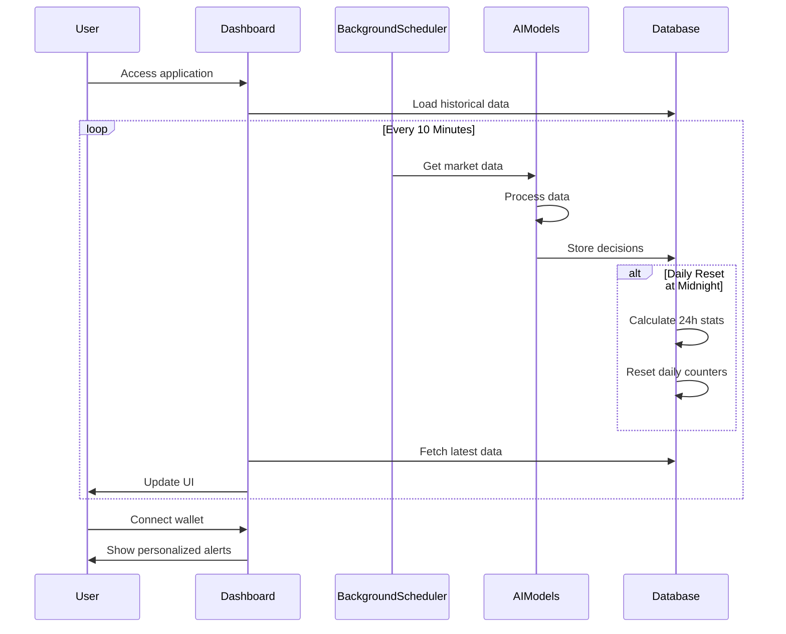

# Simple Crypto Trading Bot Chef

<div align="center">
  
  <p><em>Comparing AI Models in Crypto Trading Analysis</em></p>
</div>

## Overview

A proof-of-concept project that evaluates and compares the trading accuracy of different Large Language Models (LLMs) in cryptocurrency trading. The system provides real-time Ethereum (ETH) market data to multiple AI models and analyzes their performance through an interactive dashboard.

## Live Demo

Check out the live demo at [https://stbchef.onrender.com/](https://stbchef.onrender.com/)

<div align="center">
  
  <p><em>Trading Bot Chef Dashboard - Real-time AI Trading Analysis</em></p>
</div>

### AI Models in Action

- **Gemini 2.0 Flash** - Google's latest LLM optimized for fast, accurate trading analysis
- **Groq DeepSeek-R1-Distill-Llama-70B** - High-performance reasoning model for comprehensive market insights
- **Mistral Medium** - Advanced model providing additional trading perspectives

## Key Features

- **Real-time Monitoring**
  - Live ETH price tracking via Etherscan
  - Dynamic gas fee analysis
  - Market sentiment tracking with Fear & Greed Index
  - 10-minute update intervals for all metrics

- **AI Analysis**
  - Comparative trading signals from multiple LLMs
  - Real-time performance metrics
  - Advanced accuracy tracking system:
    - Dynamic thresholds based on market volatility
    - Weighted scoring system for recent trades
    - Performance score based on last 100 trades per model
    - Daily stats that reset at midnight
    - Shows decision distribution (Buy/Sell/Hold)

- **Interactive Dashboard**
  - ETH Live price and volume charts
  - Model performance visualization
  - Gas price in real time
  - Performance metrics:
    - 24-hour trading stats
    - Total trades within last day
    - Correct/incorrect trades
    - Average profit percentage
    - Decision distribution breakdown
    - Market volatility indicators

- **MetaMask Integration**
  - Connect wallet for personalized notifications
  - Receive alerts on LLM consensus signals
  - Track performance with wallet connection
  - Persistent wallet connection across sessions

## Technical Implementation

### Backend Architecture

The system uses a Flask web application with a background scheduler that:
- Updates trading data every 10 minutes
- Makes concurrent API calls to three different LLM providers
- Stores historical data in an SQLite database with automatic cleanup
- Maintains daily statistics with reset at midnight
- Uses thread-safe caching for performance optimization

### LLM Trading Strategy

Each AI model evaluates the same market data using these parameters:

- **Target Allocations**:
  * ETH: 60-80% in bullish conditions
  * USDC: 40-20% in bullish conditions
  * Dynamic adjustment based on market conditions

- **Decision Criteria**:
  * BUY conditions:
    - Price below support level
    - RSI oversold
    - Strong bullish momentum
    - Low gas prices
    - ETH allocation below target
  * SELL conditions:
    - Price above resistance
    - RSI overbought
    - Bearish momentum
    - High gas prices
    - ETH allocation above target
  * HOLD conditions:
    - Price within normal range
    - Current allocation optimal
    - Gas prices unfavorable
    - No clear directional bias

### Performance Tracking System


The system implements a sophisticated accuracy tracking system:

1. **Performance Score Calculation**
   - Based on weighted average of last 100 trades
   - Recent trades receive higher weight
   - Score displayed as percentage (0-100%)

2. **Daily Statistics**
   - Reset automatically at midnight
   - Track total trades in 24-hour period
   - Track correct/incorrect decisions
   - Monitor decision distribution (BUY/SELL/HOLD)
   - Calculate average profit for correct trades

3. **Visual Indicators**
   - Green: ≥65% accuracy (High Performance)
   - Yellow: ≥45% accuracy (Moderate Performance)
   - Red: <45% accuracy (Low Performance)

## Quick Start

1. **Setup Environment**
   ```bash
   # Clone the repository
   git clone https://github.com/yourusername/stbchef.git
   cd stbchef

   # Install Python 3.10+ if needed

   # Install Poetry (dependency management)
   curl -sSL https://install.python-poetry.org | python3 -

   # Install dependencies
   poetry install
   ```

2. **Configure API Keys**
   - Copy `.env.example` to `.env`
   - Add your API keys:
     ```env
     ETHERSCAN_API_KEY=your_key_here   # Get from https://etherscan.io/myapikey
     GEMINI_API_KEY=your_key_here      # Get from https://aistudio.google.com/
     GROQ_API_KEY=your_key_here        # Get from https://console.groq.com/
     MISTRAL_API_KEY=your_key_here     # Get from https://console.mistral.ai/
     ```

3. **Launch Application**
   ```bash
   # Run the Flask application
   poetry run python -m src.web.app

   # Access the dashboard at http://localhost:8080
   ```

## Technical Stack

- **Backend**
  - Python 3.10+
  - Flask web server
  - Poetry for dependency management
  - SQLite database with efficient WAL mode
  - Background scheduler for regular updates

- **Frontend**
  - TailwindCSS for styling
  - Chart.js for visualizations
  - Web3.js for MetaMask integration
  - Dynamic stats and model comparisons

- **APIs**
  - Etherscan for ETH prices and gas fees
  - Alternative.me for Fear & Greed Index
  - AI Model APIs:
    - Google Gemini 2.0 Flash
    - Groq DeepSeek-R1-Distill-Llama-70B
    - Mistral Medium

## Data Flow



## Error Handling

The system implements comprehensive error handling and validation:

- **API Response Validation**
  - Validates all API responses before processing
  - Handles empty or malformed responses gracefully
  - Provides fallback values for missing data

- **Technical Calculation Safety**
  - Try/except blocks for all numerical calculations
  - Default values for edge cases
  - Detailed logging for debugging

- **Database Operations**
  - Thread-safe operations
  - Connection pooling
  - Transaction management

## Important Disclaimer

This is an **experimental project** for educational and research purposes only:

- NOT financial advice
- NOT intended for real trading
- NO guarantee of accuracy
- For AI model comparison only
- Does NOT execute actual trades

## Requirements

- Python 3.10 or higher
- Poetry package manager
- API keys for all services
- Stable internet connection
- Modern web browser

## License

This project is licensed under the [MIT License](LICENSE).

---
<div align="center">
  <em>Built with ❤️ for AI and Crypto enthusiasts</em>
</div>